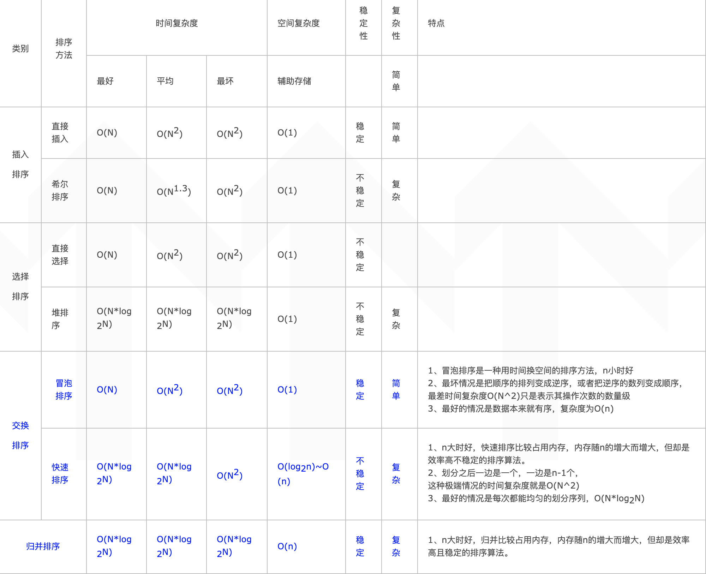

###七大常见排序算法

####1.冒泡排序

```java
/**
* 思路：每次将较大的数和后面的数交换
*/
public class BubbleSort {

    public static void sort(int[] a) {
        if (a == null || a.length < 2)  return;
        for (int i = 0; i < a.length; i++) {
            boolean flag = true;  // 冒泡排序的优化
            for (int j = 0; j < a.length - i - 1; j++) {
                if (a[j] > a[j + 1]) {
                    swap(a, j, j + 1);
                    flag = false;
                }
            }
            if (flag) break;
        }
    }

    private static void swap(int[] a, int i, int j) {
        int temp = a[i];
        a[i] = a[j];
        a[j] = temp;
    }
}
```

####2.选择排序

```java

/**
 * 思路：遍历整个数组 找到最小的数 与当前位置的数交换
 */
public class SelectSort {

    public static void sort(int[] a) {
        if (a == null || a.length < 2)  return;
        for (int i = 0; i < a.length; i++) {
            int min = i;
            for (int j = i; j < a.length; j++) {
                min = a[j] < a[min] ? j : min;
            }
            swap(a, i, min);
        }
    }

    private static void swap(int[] a, int i, int j) {
        int temp = a[i];
        a[i] = a[j];
        a[j] = temp;
    }
}
```

####3.插入排序

```java
/**
 * 思路：遍历数组 将当前数插入到前面已排好序的数组
 * 实现：循环与前一个数比较，如果比前一个数小，交换
 */
public class InsertSort {

    public static void sort(int[] a) {
        if (a == null || a.length < 2)  return;
        for (int i = 1; i < a.length; i++) {
            int j = i;
            while (j > 0 && a[j] < a[j - 1]) {
                swap(a, j, j - 1);
                j--;
            }
        }
    }

    private static void swap(int[] a, int i, int j) {
        int temp = a[i];
        a[i] = a[j];
        a[j] = temp;
    }
}
```

####4.希尔排序

```java
/**
 * 一种优化后的插入排序
 * 思路：每次分成2^n组 将每组中对应位置的数排序 当每组元素个数为1时 就是插入排序
 */
public class ShellSort {

    public static void sort(int[] a) {
        if (a == null || a.length < 2) return;
        shellSort(a);
    }

    private static void shellSort(int[] a) {
        int step = a.length / 2;
        while (step > 0) {
            // 一共step组 每组进行内部排序
            for (int i = 0; i < step; i++) {
                // 组内排序(插入排序)
                for (int j = 1; j < a.length / step; j++) {
                    int k = j;
                    while (k > 0 && a[k] < a[k - 1]) {
                        swap(a, k, k - 1);
                        k--;
                    }
                }
            }
            step = step / 2;
        }
    }

    private static void swap(int[] a, int i, int j) {
        int temp = a[i];
        a[i] = a[j];
        a[j] = temp;
    }
}
```

####5.归并排序

```java
/**
 * 思路：分治思想 每次划分2份 将每份中的数排好序 然后再合并排序
 * 实现：合并排序 使用一个额外数组 依次比较两个数组 将较小的数放入额外数组中
 *      最后将额外数组中的数 写回到原数组
 */
public class MergeSort {

    public static void sort(int[] a) {
        if (a == null || a.length < 2) return;
        merge(a, 0, a.length - 1);
    }

    /**
     * 循环递归 直到数组被分成a.length个长度为1的数组
     * @param a  需要排序的数组
     * @param left 当前数组的起始位置
     * @param right 当前数组的最终位置
     */
    private static void merge(int[] a, int left, int right) {
        if (left < right) {
            int mid = (right + left) / 2;
            merge(a, left, mid);
            merge(a, mid + 1, right);
            mergeSort(a, left, mid, right);
        }
    }

    /**
     * 利用一个辅助数组 遍历比较两个数组 将较小的数放入辅助数组
     * 将两个数组中剩余的数放入辅助数组
     * 将辅助数组中的数再替换原先数组
     * i：遍历第一个数组当前位置
     * j：遍历第二个数组当前位置
     * k：辅助数组当前位置
     * temp：辅助数组
     * @param a
     * @param left 第一个数组的起始位置
     * @param mid 第一个数组的结束位置  mid+1 为第二个数组的起始位置
     * @param right 第二个数组的结束位置
     */
    private static void mergeSort(int[] a, int left, int mid, int right){
        int i = left, j = mid + 1, k = 0;
        int[] temp = new int[right - left + 1];
        while (i <= mid && j <= right) {
            // 将较小的数放入额外数组中
            temp[k++] = a[i] < a[j] ? a[i++] : a[j++];
        }
        // 下面两个while循环只会执行一个  将剩余的数放入额外数组中
        while (i <= mid) temp[k++] = a[i++];
        while (j <= right) temp[k++] = a[j++]
        for (int t = 0; t < right-left+1; t++) {
            a[t + left] = temp[t];
        }
    }
}

```

####6.快速排序

```java
/**
 * 思路：每次选择一个数为基准 遍历整个数组 将这个数组调整为 比这个数小的都在它左边
 *      比这个数大的都在它右边 直到整个数组都有序
 */
public class QuickSort {

    public static void sort(int[] a) {
        if (a == null || a.length < 2)  return;
        quickSort(a, 0, a.length - 1);
    }

    private static void quickSort(int[] a, int left, int right) {
        if (left < right) {
            // 从数组中随机选定一个数作为被比较的数，和数组最后一个数交换
            swap(a, right, left + (int) (Math.random() * (right - left + 1)));
          // 优化 传统快排分两段 这个快排分三段 多一段和选定值相等的
            int[] temp = sort(a, left, right);
            quickSort(a, left, temp[0]);
            quickSort(a, temp[1], right);
        }
    }

    /**
     * 此方法排序后数组被分成三段，小于选定值的（无序）、等于选定值的、大于选定值的（无序）
     * @param a 需要进行排序的数组
     * @param left 开始作为排序数组的左边界，实际用来遍历数组
     * @param right 这个位置的值当做被比较的值（选定值）
     * @return
     */
    private static int[] sort(int[] a, int left, int right) {
        // 记录小于和大于选定值的边界
        int i = left - 1, j = right;
        while (left < j) {  // 循环遍历整个数组
            if (a[left] < a[right]) { //当前值小于选定值，左边界向右移动下一个数
                // 此交换无实际意义 等价于--> i++; left++;
                swap(a,++i,left++);
            // 当前值大于选定值，交换两个数，大于选定值的边界向左移动
            // 此时交换的来的新值无法确认与选定值的大小关系，还需要继续比较
            } else if (a[left] > a[right]) {
                swap(a, left, --j);
            } else {  // 当前值等于选定值，下一个数
                left++;
            }
        }
    // 遍历完成，将选定值与右边界的值进行交换，此时数组分为3段：小于、等于、大于选定值
        swap(a, right, j);
        // 返回此时数组的小于选定值的边界和大于选定值的边界
        return new int[]{i, j + 1};
    }

    // 交换数组中两个位置的值
    private static void swap(int[] a, int i, int j) {
        int temp = a[i];
        a[i] = a[j];
        a[j] = temp;
    }
}
```

####7.堆排序

```java
/**
 * 思路：遍历数组构建一个大顶堆 堆顶元素为这个数组中最大的数
 *      每次将堆顶的元素和堆底的元素交换 调整堆结构
 *      每次交换  最后i个数已经有序
 */
public class HeapSort {

    public static void sort(int[] a) {
        if (a == null || a.length < 2)  return;
        // 遍历数组，将数组构建成一个大根堆
        for (int i = 0; i < a.length; i++) {
            buildHeap(a, i);
        }
        // 排序大根堆，将最大的数放在数组最后位置，依次进行
        int size = a.length;
        // 交换数组第一个和最后一个数的位置，第一个数为大根堆堆顶，为数组中最大的数
        swap(a, 0, --size);
        while (size > 0) {
            heapify(a, 0, size);
            swap(a, 0, --size);
        }
    }

    /**
     * 将交换后的堆进行重新调整为大根堆
     * @param a
     * @param index
     * @param size 数组待排序位置的大小
     */
    private static void heapify(int[] a, int index, int size) {
        // 左孩子节点
        int left = index * 2 + 1;
        // 存在左孩子节点
        while (left < size) {
            // largest ————> 左孩子节点和右孩子节点中较大的位置
            //            | 存在右孩子节点 |   |左孩子节点小于右孩子节点|
            int largest = left + 1 < size && a[left] < a[left + 1] ? left + 1 : left;
            // 父节点与刚比较出来的较大的值进行比较，得到更大的值的位置
            largest = a[largest] > a[index] ? largest : index;
            // 最大的值是父节点，当前数组已是大根堆，退出
            if (largest == index) break;
            // 最大的值是孩子节点，交换父节点和较大的孩子节点
            swap(a, index, largest);
            // 父节点位置改为刚刚较大的节点的位置
            index = largest;
            // 新父节点的左孩子节点的位置
            left = index * 2 + 1;
        }
    }

    /**
     * 构建大根堆
     * @param a
     * @param index
     */
    private static void buildHeap a, int index) {
        // 循环比较根节点和父节点的大小，如果大于父节点，交换
        while (a[index] > a[(index - 1) / 2]) {
            swap(a, index, (index - 1) / 2);
            index = (index - 1) / 2;
        }
    }

    private static void swap(int[] a, int i, int j) {
        int temp = a[i];
        a[i] = a[j];
        a[j] = temp;
    }
}
```

####总结

各大排序算法的复杂度：



注：

1、归并排序每次递归都要用到一个辅助表，长度与待排序的表长度相同，虽然递归次数是O(log2n)，但每次递归都会释放掉所占的辅助空间，

2、快速排序空间复杂度只是在通常情况下才为O(log2n)，如果是最坏情况的话，很显然就要O(n)的空间了。当然，可以通过随机化选择pivot来将空间复杂度降低到O(log2n)。 

相关概念：

1、时间复杂度

​     时间复杂度可以认为是对排序数据的总的操作次数。反映当n变化时，操作次数呈现什么规律。

​     常见的时间复杂度有：常数阶O(1),对数阶O(log2n),线性阶O(n), 线性对数阶O(nlog2n),平方阶O(n2)

​     时间复杂度O(1)：算法中语句执行次数为一个常数，则时间复杂度为O(1),

2、空间复杂度

​    空间复杂度是指算法在计算机内执行时所需存储空间的度量，它也是问题规模n的函数

​    空间复杂度O(1)：当一个算法的空间复杂度为一个常量，即不随被处理数据量n的大小而改变时，可表示为O(1)

​    空间复杂度O(log2N)：当一个算法的空间复杂度与以2为底的n的对数成正比时，可表示为O(log2n)

​                                 ax=N，则x=logaN，

​    空间复杂度O(n)：当一个算法的空间复杂度与n成线性比例关系时，可表示为0(n).